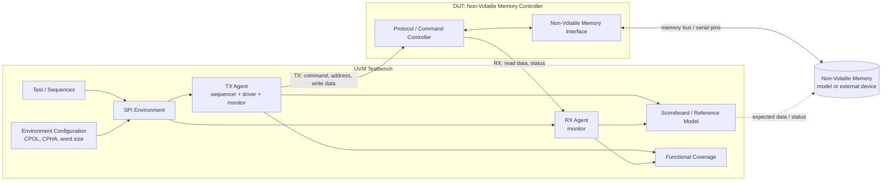

# SPI Verification IP architecture

## Main data paths

- **TX** drives commands, addresses, and write data into the DUT.
- **RX** observes read data and status returned by the DUT.
- The DUT converts transactions into accesses on the non-volatile-memory interface.
- The scoreboard compares observed RX traffic with the reference memory model; coverage tracks protocol modes, commands, addresses, data, and error handling.
